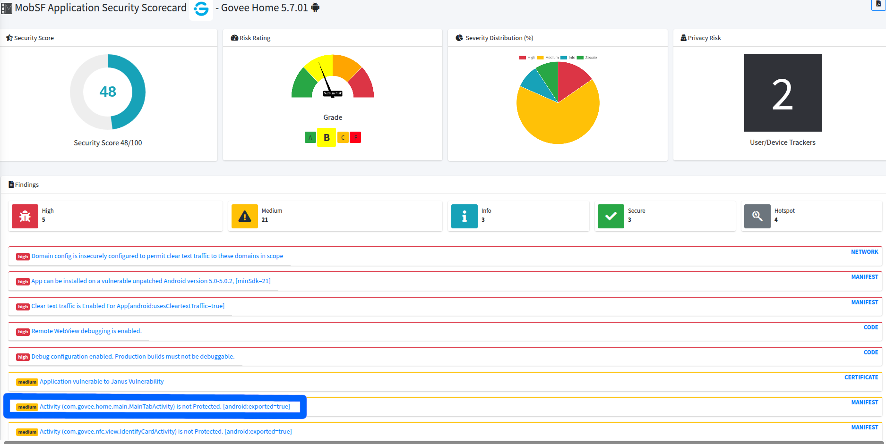
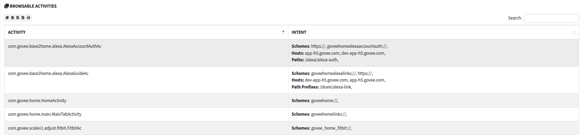
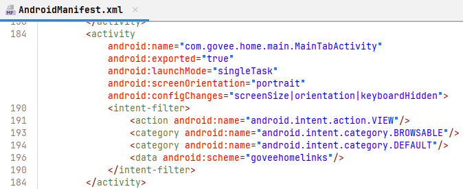
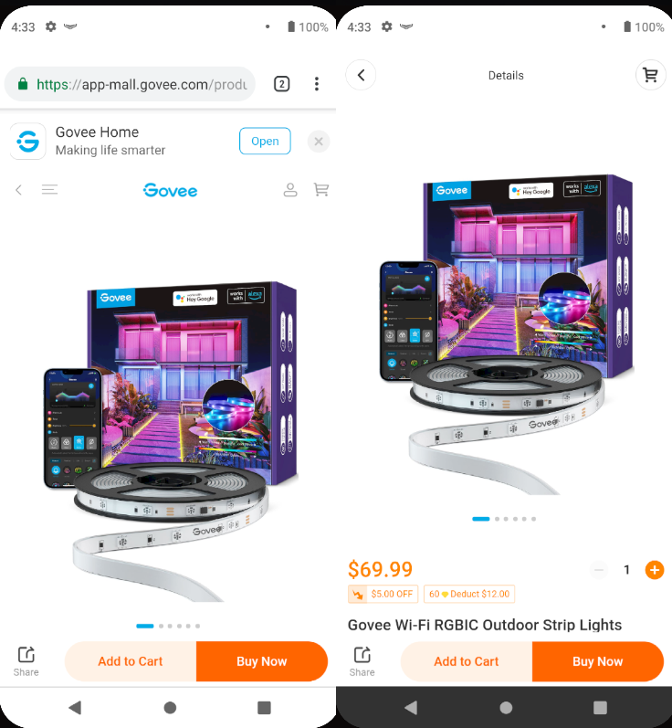
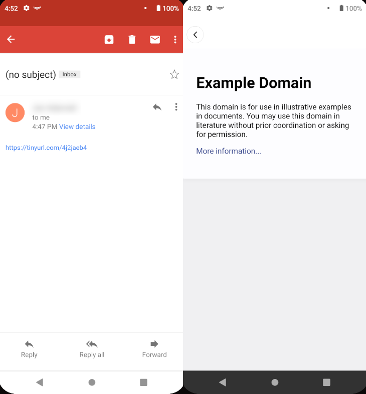
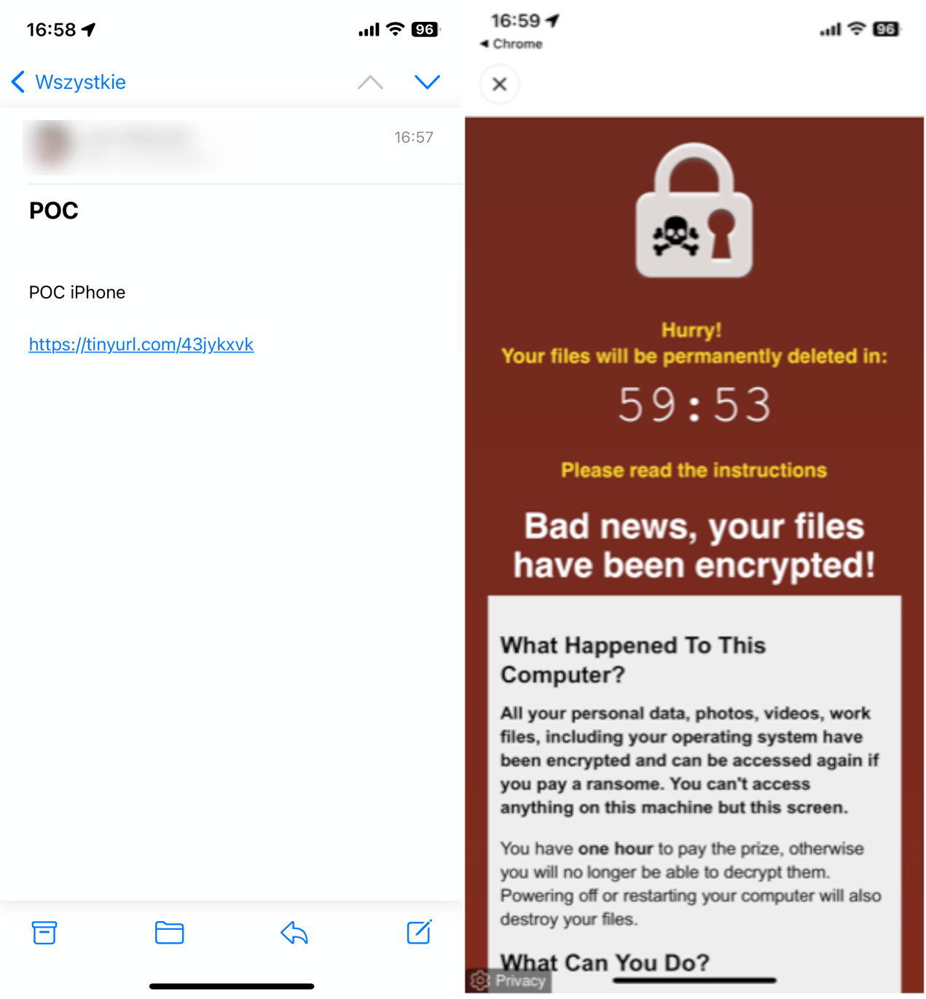

# CVE-2023-3612 - Unrestricted WebView in the Govee Home Mobile App

> Technical supplement to the article *PMIoT - Pentesting Methodology of IoT* (Section "Vulnerability 3 - insecure WebView component"). This document walks through the full story of how the vulnerability was discovered, how it was confirmed, and how it was responsibly disclosed. It expands on the article with additional details, tooling notes, evidence material, and remediation advice. 

**Although the pentesting procedure was conducted step by step in accordance with the proposed methodology, this supplement presents only those testing activities that resulted in relevant findings for described vulnerability**

---

## Overview

| | |
|---|---|
| **CVE identifier** | CVE-2023-3612 |
| **CVSS v3.1** | 8.8 (High) |
| **CWE** | CWE-749 Exposed Dangerous Method or Function |
| **Affected vendor** | Govee |
| **Affected component** | Govee Home mobile app - WebView handling (package `com.govee.home`, main activity `com.govee.home.HomeActivity`) |
| **Affected versions** | Govee Home Android and iOS < 5.8.01 (tested on 5.7.01/5.7.03) |
| **Affected platforms** | Android and iOS |
| **PMIoT layer** | Mobile application layer |
| **Attack prerequisites** | Victim taps an attacker-crafted link (social engineering); no special privileges needed |
| **Impact** | Arbitrary `https://` content rendered full-screen inside the vendor's app, no URL bar, preceded by the vendor's loading screen - possible credible in-app phishing / credential theft |


---

## Background


The MobSF scan flagged several exported activities - precisely the "hot spots" that the article's mobile-layer methodology prioritizes for manual review. Among them were entry points that handle WebView views: the vendor uses this solution to display user regulations and the Govee online store, keeping content remote so that updates require no new app releases.
<p align="center">

</p>

---

## Story of the discovery

### Step 1 - Automatic analysis flags exported activities (MobSF)

The static scan (MobSF) listed exported activities and WebView-related components. Manual `AndroidManifest.xml` and code inspection with jadx followed, mapping which activities render WebView content and how they can be invoked from outside the app. Log analysis during app usage had already hinted that the built-in online store is realized as a plain WebView and that opened URLs are logged.
<p align="center">


</p>

### Step 2 - Finding the full activation scheme
The key question was whether the WebView can be pointed at an arbitrary URL, and whether an external party can trigger it. Analysis of the intent-handling code (jadx) revealed the internal routing scheme: an intent carrying a JSON payload with two parameters - type and url (`type: 4` routes to the WebView view). Tests began from a completely legitimate entry point: sharing a store offer found in the app's built-in shop. Tapping the shared link on a second device displayed a system prompt offering to open the content directly in the Govee app.
<p align="center">

</p>
Using the Chrome remote debugger, the scripts behind this redirection were analyzed, confirming the link structure. A legitimate vendor link looks like:

```text
intent://scan/#Intent;scheme=goveehomelinks;package=com.govee.home;
S.value={"type":4,"url":"https%3A%2F%2Fapp-mall.govee.com%2Fproduct-detail%3Fsku%3DH61721D1%26site%3DUS%26..."};end
```

For iOS, the equivalent custom-scheme structure deduced from script analysis:

```text
goveehome://speView?type=4&url=https%3A%2F%2Fapp-mall.govee.com%2Fproduct-detail%3Fsku%3DH61721D1%26site%3DUS%26...
```

The URL must start with `https` and be UTF-8 / percent-encoded.

### Step 3 - Confirming the vulnerability on external addresses

The test was simple: replace the vendor URL with a third-party one, shortened with a URL-shortening platform (the same delivery trick an attacker would use). Crafted test links:

* Android (opening `https://example.org`), shortened via tinyurl:
  ```text
  intent://scan/#Intent;scheme=goveehomelinks;package=com.govee.home;
  S.value={"type":4,"url":"https%3A%2F%2Fexample.org"};end
  ```
* iOS (opening `https://pranx.com/fake-virus/`), shortened via tinyurl:
  ```text
  goveehome://speView?type=4&url=https%3A%2F%2Fpranx.com%2Ffake-virus%2F
  ```

The app rendered arbitrary external `https://` content in a full-screen WebView on both platforms, with three aggravating properties:

* no URL bar, no loaded-domain indicator, no warning that remote content is displayed;
* the content load is preceded by the legitimate Govee loading screen making it look like a normal in-app action;
* the software keyboard is available on the rendered page - input fields and thus a fake login form are fully interactive.

<p align="center">
  
  &nbsp;&nbsp;
  
</p>

### Step 4 - The phishing attack scenario (impact)

The demonstrated issue can become credential theft with use of basic social engineering:

1. The attacker prepares a replica of the Govee login page on his own `https://` domain.
2. He packages the crafted link in an e-mail / message ("confirm your account status", "join Govee Cloud", a shared store offer) behind a shortened URL.
3. The victim taps the link - the content opens inside the genuine Govee Home app, after the genuine loading screen.
4. Under the pretext of "please log in again", the victim submits credentials into the fake form. By actively listening for the victim’s credentials, the attacker can also prepare a fake MFA code view, simultaneously log in to the victim’s legitimate account using the hijacked credentials, and obtain a legitimate MFA code from the unaware victim.

Nothing on the screen tells the victim they left the vendor's environment - the app context (loading screen, full-screen layout) is the strongest possible phishing credibility boost. The vulnerability affected both Android and iOS, all app versions before the patch.

---

## Remediation advice

1. Whitelist/filter the URLs the WebView activity may load - only vendor-controlled domains (the fix suggested in the report and applied by the vendor).
2. Show the loaded URL (or at least a "you are leaving the app" warning) whenever a WebView loads a non-first-party domain.
3. Never pass raw URLs through intent extras / custom-scheme deeplinks to a generic renderer; use opaque identifiers resolved server-side or cryptographically signed URLs.
4. Harden the WebView itself: disable JavaScript, file access, and form submission in views that only display static content (regulations, help pages).
5. Make deeplink entry points visually distinguishable so users can differentiate in-app content from external content.

---

## Methodology notes

* This finding came strictly from the mobile application layer procedures of the article: automatic analysis (MobSF), manual code and manifest analysis (jadx), application flow, deeplink and exported-activity testing ("special attention is given to QR scanners and other functions prone to phishing attacks or malicious URL handling").
