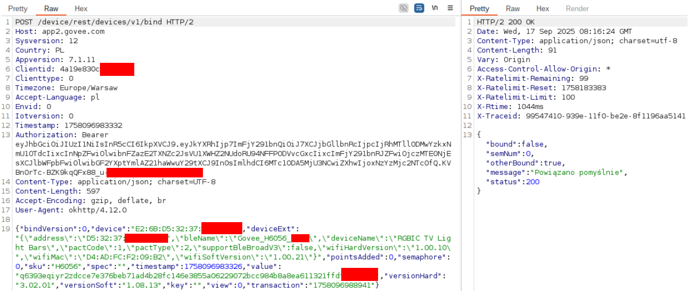
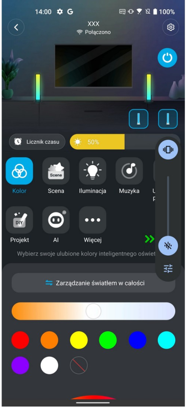

# CVE-2025-10910 - The Second Device Hijack: Incomplete Remediation of the Device-Binding Procedure

> Technical supplement to the article *PMIoT - Pentesting Methodology of IoT* (Section "Vulnerability 2 - incomplete remediation of the insecure process of adding a new device").
> This is the direct continuation of the CVE-2023-4617 vulnerability: after the vendor patched the app, we re-examined the device-adding scheme - and the patched gate could still be walked around. This document explains what changed, what did not, and how the vulnerability was reproduced end-to-end.

**Although the pentesting procedure was conducted step by step in accordance with the proposed methodology, this supplement presents only those testing activities that resulted in relevant findings for described vulnerability**

---

## Overview

| | |
|---|---|
| **CVE identifier** | CVE-2025-10910 |
| **CVSS v3.1** | 9.3 (Critical) |
| **CWE** | CWE-639 Authorization Bypass Through User-Controlled Key |
| **Affected vendor** | Govee |
| **Affected devices (verified)** | Govee H6056 (firmware 1.08.13) |
| **Probable scope** | All Govee cloud-connected devices sharing the same enrollment mechanism (very likely broader device scope) |
| **Affected component** | Cloud/API device-binding procedure - the same mechanism as CVE-2023-4617, after the vendor's remediation |
| **PMIoT layers involved** | Cross-layer: cloud/IP network, mobile application |
| **Attack prerequisites** | Govee account + knowledge of the target device ID and the (unchanged) structure of the hashed string |
| **Impact** | Arbitrary devices bindable to an attacker-controlled account: full remote takeover|

---

## Background

Eliminating CVE-2023-4617 took the vendor nearly a year: new firmware was released and pushed on 2024-07-01, and the vulnerability was published by CERT Polska on 2024-12-19. The remediation, however, was applied at the application and API level - the app logic was fixed so the original enrollment function could no longer be abused directly, and additional API usage limitations were introduced.

The PMIoT-motivated question we asked after remediation was simple and worth asking after any patch: did the fix change the design, or only blocked original way to hijack app function? We decided to research the device-adding scheme again - and the answer exposed a recurring, and arguably more instructive, problem:

* the underlying enrollment mechanism did not change - it still does not rely on any device-specific secret;
* the binding request's security parameter (`value`) is still computed solely from predictable inputs;
* the inputs and the computation (a plain hash function over the known dot-separated string) were already known from the pre-patch research;
* an attacker who derives the computation formula can therefore reproduce the entire device-addition procedure outside the mobile application.

> This section draws an explicit lesson (per the article's conclusion): remediation that hardens the client but leaves the server-side protocol semantics intact provides only a configuration-effective fix - in this case, the knowledge of the hashed-string structure from before the patch transferred 1:1 to the post-patch world.

---

## Story of the re-discovery

### Step 1 - Re-examining the patched pairing scheme

Following the same PMIoT procedure as in 2023 (see `CVE-2023-4617.md` in this repository for the full walkthrough), we re-analyzed the process of adding a device to an account: app traffic interception through the proxy environment, jadx inspection of the updated app, and Frida monitoring of the crypto functions involved in pairing.

Confirmed first: the vendor's fixes do work against the original attack. The direct abuse of the enrollment function inside the app - the exact Frida hook path used for CVE-2023-4617 - no longer yields a takeover. Moreover, new app internal functions blocked opportunity to not only use function to generate new value but also to read the input string scheme.

### Step 2 - What did not change: the bind request and its `value`

The bind endpoint and the request structure, however, remained the same: `device` (predictable prefixed-MAC identifier), `sku` (closed set of models), `timestamp` (self-chosen), `transaction` (presence-only), and the `value` "security parameter".

As established during the pre-patch research (documented in the CVE-2023-4617 write-up), the input to the `value` computation is a dot-separated concatenation of:

```text
<account-identity>.<client-id>.0.<device-model>.<device-ID>.<timestamp>
```

- i.e., only attacker-knowable data: the attacker's own account parameters, the target's model and ID, and a freely chosen timestamp. The `value` is a plain hash function over this string. No device-side secret participates; the enrollment binds whoever can compute the hash - which is anyone who knows the formula, not anyone who owns the device.

### Step 3 - Reproducing the procedure without the app

Because the formula and its inputs were unchanged, the whole bind procedure could be reproduced outside the mobile application: prepare the input string for the target device, compute the hash (the same function identified earlier in `EncryptUtils`), and send a single, minimal, properly authenticated `POST /device/rest/devices/v1/bind` request - exactly the "after the request pattern is known, the pairing of any other device is needed only to generate the appropriate value" observation from the first report, now it is possible without the app.

Result: arbitrary devices could still be added to an attacker-controlled account, leading to:

* full device takeover (control + data access over the Internet, even though the attacker was never in the target's network);
* automatic removal of the device from the legitimate user's account - without notification, while the device keeps using the victim's Wi-Fi.

<p align="center">

</p>

The scope limitation practices from the first round were kept: the PoC targeted only tester-owned devices, and the mass-attack capability was demonstrated structurally (keyspace analysis) rather than executed.


<p align="center">

</p>

### Step 3a - Creating the `value` parameter

The `value` parameter is generated with the function:

```text
value = nonce + hex_lowercase(HMAC_SHA256(key = nonce, message = content))
```

where:

* `nonce` = chosen prefix, e.g. `"0000000000000000"`
* `content` = `7311XXX.4a19e830c916XXXX.0.H6056.E2:6B:D5:32:37:XX:XX:XX.1758096983326`

Explanation of the content parameters:

| Fragment | Meaning |
|---|---|
| `7311XXX` | identity parameter from the `GET /bi/rest/v1/user-informations` HTTP/2 query belonging to the attacker's account |
| `4a19e830c916XXXX` | ClientID parameter, available in most queries after logging in |
| `H6056` | Device model (SKU) |
| `E2:6B:D5:32:37:XX:XX:XX` | device ID, based on the device's MAC address - may be brute-forced |
| `1758096983326` | timestamp, which will later have to be included in the content of the sent query |

The `value` parameter contained later in the query is the result of the presented function `value`.

Importantly, not all values sent in the body of the request are relevant. Changing, for example, the `wifiMAC` address does not make it impossible to remotely connect to the hijacked device. The content of the request, limited only to the necessary information, is included below:

```python
payload = {
    "bindVersion": 0,
    "device": DEVICE_ID,
    "deviceExt": {
        "address": "dev_address",
        "bleName": "XXX",
        "deviceName": "XXX",
        "pactCode": 1,
        "pactType": 2,
    },
    "pointsAdded": 0,
    "semaphore": 0,
    "sku": "dev_model",
    "spec": "",
    "timestamp": timestamp,
    "value": value,
    "versionHard": "XXX",
    "versionSoft": "XXX",
    "key": "",
    "view": 0,
    "transaction": "some_number",  # it is working, but our tests showed that it can be other value
}
```

The lamps were connected to Wi-Fi and connected to another Govee account at the time of trying the procedure. 

After running the attack we got the following response from the server:

```text
Status code: 200
Response headers: {'Date': 'Wed, 17 Sep 2025 11:52:28 GMT', 'Content-Type': 'application/json; charset=utf-8', 'Content-Length': '91', 'Connection': 'keep-alive', 'Vary': 'Origin', 'Access-Control-Allow-Origin': '*', 'X-RateLimit-Remaining': '88', 'X-RateLimit-Reset': '1758183383', 'X-RateLimit-Limit': '100', 'X-RTime': '342ms', 'X-traceId': 'c8c761d0-93bc-11f0-a43e-cfbbe91dcfaf'}
Response JSON: {'bound': False, 'semNum': 0, 'otherBound': True, 'message': 'Powiązano pomyślnie', 'status': 200}
```

The device is visible and fully operational on the attacker's account and also deleted from the original user's account.

The vulnerability is critical for users' safety and comfort. Taking over control of lights and other products such as heaters or smart plugs can lead to huge financial losses and frustrations. Taking into account the scale of the Govee brand, the vulnerability can affect several million devices. It is also correlated with CVE-2023-4617 reported by us in 2023. The vendor fixed the mobile app, which can't now be used to prepare `value` for a device desired by the attacker, but we found a way to reproduce the `value` parameter outside the app.

---

## Impact

Identical in impact to CVE-2023-4617 - the difference is in the path:

* full remote takeover of diverse Govee cloud-connected devices;
* mass-scale feasibility (predictable device IDs; the hash formula is now easy to compute using script with SHA256);
* affects devices using firmware operating with (or compatible with) the patched app ecosystem - confirmed on H6056 firmware 1.08.13; very likely broader device scope since the enrollment mechanism is shared across different product categories.

---

## Remediation advice

The advice carries over from CVE-2023-4617, now sharpened by the failed first attempt:

1. Fix the protocol, not the client. The `value` parameter must incorporate a device-side secret or a freshness token obtained from the device (over the authenticated BLE channel during pairing) so that possessing the app (or knowing the formula) is insufficient to bind.
2. Binding is not verifying ownership. The server must require proof of possession - e.g., a challenge encoded in a token that only the physically present device can read over BLE - before transferring ownership of an already-bound device.
3. Treat attempts to re-bind already-bound devices as a security event: alert, and notify the current owner with a confirmation flow.
4. Harden neighboring mechanisms in the same enrollment path (the unauthenticated certificate re-issuing endpoint noted in the CVE-2023-4617 write-up) as part of the same remediation effort, not separately.
5. Regression-test patches against the vulnerability class (CWE-639, user-controlled keys), not only against the specific reported PoC - our second report is precisely what that practice would have caught.

---

## Methodology notes

* The finding validates two claims of the PMIoT article: that a patch must be verified against the original attack workflow (re-testing remediated findings is part of the reporting pillar), and that enrollment and binding flows deserve cross-layer testing - the flaw lived between cloud-API semantics and knowledge extracted from the mobile layer.
* Knowledge reuse mattered: nothing in the second test required new tooling - the same Wireshark/proxy/nmap/jadx/Frida stack and the earlier documented structure of the hashed string were sufficient. A well-documented first pentest (per the reporting requirements of PMIoT) directly enabled the second finding.
* The story of these vulnerabilities is a good example of how important responsible remediation and control over app releases are. Moreover, sometimes testing older versions of apps can lead to findings that may then be crucial for exposing vulnerabilities that would not be found when testing only newer versions, while still potentially exposing users to risk. It is also a good point for discussion about the role and risks associated with older APK mirrors. 
